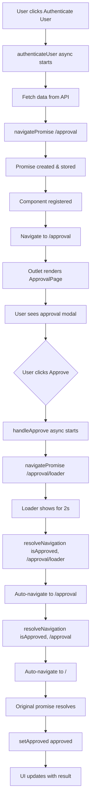

# Promise-Based Navigation: Managing Business Logic Without useEffect

This document explains how this application manages business logic flow through promise-based navigation instead of relying on `useEffect` hooks for state synchronization and side effects.

## Core Concept

Instead of using `useEffect` to react to route changes or state updates, this application uses **promise-based navigation** where:

1. Navigation is **awaitable** - it returns a Promise that resolves when the user completes an action
2. Business logic flows **linearly** through async/await chains
3. Components are **dynamically registered** at navigation time with JSX
4. State management happens **explicitly** in event handlers, not reactively
5. Navigation is **in-memory** - doesn't affect browser URL or history

## Architecture Overview

### Key Components

1. **Navigation Promise Manager** (`src/utils/navigationPromiseManager.ts`)
   - Manages pending navigation promises
   - Registers and retrieves dynamic route components
   - Provides `resolveNavigation` and `rejectNavigation` functions
   - Automatically navigates to parent paths on resolution

2. **Navigation Context** (`src/context/NavigationContext.tsx` & `NavigationProvider.tsx`)
   - Custom React Context for in-memory navigation
   - Provides current `location` and `navigate` function
   - Doesn't affect browser URL - purely in-memory routing

3. **Outlet Component** (`src/components/Outlet.tsx`)
   - Renders dynamically registered components
   - Supports nested routing with `parentPath` prop
   - Provides fallback content when no route matches

4. **Awaitable Navigation Hook** (`src/hooks/useAwaitableNavigation.ts`)
   - Wraps the context's `navigate` function
   - Returns a function that navigates and returns a Promise

## How It Works

### 1. Initiating Navigation with a Promise

When you want to navigate and wait for user input, you call `navigatePromise`:

```typescript
const navigatePromise = useAwaitableNavigation();

const authenticateUser = async () => {
  const response = await fetch(`${url}/todos/1`);
  const data: { title: string } = await response.json();

  // Navigate to approval page and wait for user decision
  const approved = await navigatePromise<boolean>(
    "/approval",
    <ApprovalPage text={data.title} />
  );

  // Business logic continues here after user responds
  setApproved(approved);
};
```

**What happens:**
1. A Promise is created and stored in `pendingNavigations` map
2. The component (`<ApprovalPage>`) is registered for the route path
3. In-memory navigation occurs (no browser URL change)
4. The Promise remains pending until `resolveNavigation` is called

### 2. Rendering with Outlet

The `Outlet` component retrieves and renders registered components:

```typescript
// Root outlet - renders top-level routes
<Outlet />

// Nested outlet - renders child routes under a parent path
<Outlet parentPath="/approval">
  <ApprovalActions /> {/* Fallback content */}
</Outlet>
```

**How Outlet works:**
- **Root outlets**: Extract the first segment (e.g., `/approval/loader` → `/approval`) and render that component
- **Nested outlets**: Match routes under the `parentPath` (e.g., `/approval/loader` when `parentPath="/approval"`)
- **Fallback**: Render children when no matching component is found

### 3. Resolving Navigation with Business Logic

When the user completes an action, the destination component calls `resolveNavigation`:

```typescript
const handleApprove = async () => {
  // Navigate to loader (another promise-based navigation)
  const isApproved = await navigatePromise(
    "/approval/loader",
    <Loader isApproving={true} />
  );
  
  // Resolve the parent navigation with the result
  resolveNavigation(isApproved, "/approval");
};
```

**What happens:**
1. The loader navigation completes and returns a value
2. `resolveNavigation` finds the pending promise for `/approval`
3. The promise resolves with the value
4. **Automatic parent navigation**: Navigates from `/approval` to `/` (parent path)
5. Control returns to the original `await` statement
6. Business logic continues with the resolved value

### 4. Accessing Current Location

Components can access the current in-memory location using `useNavigation`:

```typescript
const [location, navigate] = useNavigation();

// Use location for resolveNavigation
resolveNavigation(value, location);

// Or navigate directly (rarely needed)
navigate("/some/path");
```

## Business Logic Flow Example

Here's a complete flow through the authentication example:



## Key Benefits

### 1. **Linear, Readable Code Flow**

Business logic reads top-to-bottom like synchronous code:

```typescript
// Clear, linear flow
const result = await fetchData();
const userDecision = await navigatePromise("/approval", <Page />);
const processed = await processResult(userDecision);
updateState(processed);
```

Instead of scattered `useEffect` hooks:

```typescript
// ❌ Traditional approach - logic scattered
useEffect(() => {
  if (data) {
    navigate("/approval");
  }
}, [data]);

useEffect(() => {
  if (approved !== null) {
    processResult(approved);
  }
}, [approved]);
```

### 2. **Explicit State Management**

State updates happen explicitly in event handlers, making it clear when and why state changes:

```typescript
const handleApprove = async () => {
  const result = await navigatePromise(...);
  resolveNavigation(result, location);  // Explicit resolution
  setState(result);                      // Explicit state update
};
```

### 3. **Type-Safe Navigation**

TypeScript can infer return types from promises:

```typescript
const approved: boolean = await navigatePromise<boolean>(
  "/approval",
  <ApprovalPage />
);
```

### 4. **No Race Conditions**

Since navigation is awaited, you can't have race conditions from multiple rapid navigations. Each navigation completes before the next begins.

### 5. **Clean Browser History**

In-memory navigation doesn't pollute browser history:
- Back button works normally
- No accidental navigation back to intermediate states
- URL stays clean and shareable

### 6. **Automatic Parent Navigation**

`resolveNavigation` automatically navigates to the parent path:
- `/approval/loader` → `/approval`
- `/approval` → `/`
- No manual cleanup navigation needed

## Comparison: Promise-Based vs useEffect-Based

### Promise-Based (This App)

```typescript
const authenticateUser = async () => {
  const data = await fetchData();
  const approved = await navigatePromise("/approval", <Page text={data.title} />);
  setApproved(approved);  // Direct, explicit
};
```

**Pros:**
- Linear, easy to follow
- No dependency arrays to manage
- Type-safe
- No race conditions
- Explicit control flow
- No URL pollution

### useEffect-Based (Traditional)

```typescript
const [data, setData] = useState(null);
const [approved, setApproved] = useState(null);

useEffect(() => {
  fetchData().then(setData);
}, []);

useEffect(() => {
  if (data) {
    navigate("/approval");
  }
}, [data]);

useEffect(() => {
  if (approved !== null) {
    // Handle approval
  }
}, [approved]);
```

**Cons:**
- Logic scattered across multiple effects
- Dependency arrays can cause bugs
- Hard to trace execution flow
- Race conditions possible
- Requires careful cleanup

## Implementation Details

### Navigation Promise Manager

The core system uses two Maps and a stored navigate function:

1. **`pendingNavigations`**: Stores Promise resolvers keyed by route path
2. **`routeComponents`**: Stores React components keyed by route path
3. **`storedNavigate`**: Reference to the navigate function for auto-navigation

```typescript
// Creating a navigation promise
const promise = new Promise<T>((resolve, reject) => {
  pendingNavigations.set(routePath, { resolve, reject });
  registerRouteComponent(routePath, component);
  navigate(routePath); // In-memory navigation
});

// Resolving a navigation promise
const resolver = pendingNavigations.get(pathname);
resolver?.resolve(value);
pendingNavigations.delete(pathname);
clearRouteComponent(pathname);
// Auto-navigate to parent path
storedNavigate(getParentPath(pathname));
```

### In-Memory Navigation

All navigation happens in memory using React Context:

```typescript
// NavigationProvider manages location state
const [location, setLocation] = useState("/");

const navigate = useCallback((to: string) => {
  setLocation(to);
}, []);
```

This means:
- Browser URL never changes
- No history entries created
- Perfect for modal/flow navigation
- Main app routes use React Router separately

### Parent Path Calculation

`resolveNavigation` automatically calculates and navigates to the parent:

```typescript
const getParentPath = (pathname: string): string => {
  const segments = pathname.split("/").filter(Boolean);
  if (segments.length <= 1) return "/";
  segments.pop();
  return "/" + segments.join("/");
};

// Examples:
// "/approval/loader" → "/approval"
// "/approval" → "/"
// "/" → "/"
```

### Outlet Rendering Logic

**Root Outlet** (no `parentPath`):
```typescript
// Extracts first segment: /approval/loader → /approval
const pathParts = location.split("/").filter(Boolean);
const topLevelPath = "/" + pathParts[0];
const component = getRouteComponent(topLevelPath);
```

**Nested Outlet** (with `parentPath`):
```typescript
<Outlet parentPath="/approval">
  <ApprovalActions /> {/* Shows when location is exactly /approval */}
</Outlet>

// When location is /approval/loader, renders the Loader component
// When location is /approval, renders the fallback (ApprovalActions)
```

## Common Patterns

### 1. Simple Approval Flow

```typescript
const approved = await navigatePromise<boolean>(
  "/approval",
  <ApprovalPage text="Approve this?" />
);

if (approved) {
  // Handle approval
}
```

### 2. Multi-Step Flow

```typescript
const step1 = await navigatePromise("/step1", <Step1 />);
const step2 = await navigatePromise("/step2", <Step2 data={step1} />);
const step3 = await navigatePromise("/step3", <Step3 data={step2} />);
// Each step resolves before the next begins
```

### 3. Nested Flows

```typescript
// Parent flow
const approved = await navigatePromise("/approval", <ApprovalPage />);

// Inside ApprovalPage, child flow
const confirmed = await navigatePromise("/approval/loader", <Loader />);
resolveNavigation(confirmed, "/approval"); // Resolves parent
```

## When to Use This Pattern

**Use promise-based navigation when:**
- You need to wait for user input before continuing
- Business logic depends on navigation outcomes
- You want explicit, linear control flow
- Type safety is important
- You're building modal/wizard flows
- Navigation shouldn't affect browser URL

**Don't use when:**
- Simple navigation without waiting for results
- Navigation is purely presentational
- You need deep linking to intermediate states
- You want browser back/forward to work through the flow

## Edge Cases Handled

1. **User closes modal**: `rejectNavigation()` is called with an error
2. **Component not registered**: `Outlet` shows an error message
3. **Multiple navigations**: Each has its own promise, no conflicts
4. **Component unmounting**: Cleanup happens automatically via `clearRouteComponent`
5. **Auto parent navigation**: `resolveNavigation` automatically navigates back

## Conclusion

This promise-based navigation pattern provides a clean, type-safe way to manage business logic flow without relying on `useEffect`. It makes code more readable, maintainable, and less prone to bugs from reactive state management.

The key insights are:
- **Navigation becomes a first-class async operation** that you can await, just like API calls
- **In-memory routing** keeps flows separate from main app navigation
- **Automatic parent navigation** reduces boilerplate and cleanup code
- **Nested Outlets** enable complex multi-step flows with clear hierarchy

This transforms navigation from a side effect into a controllable part of your business logic flow.
